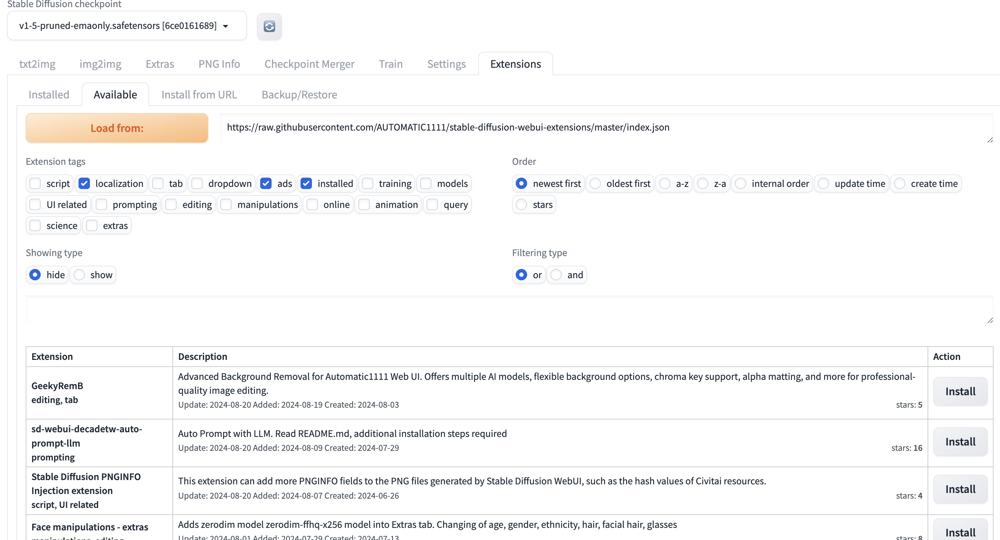
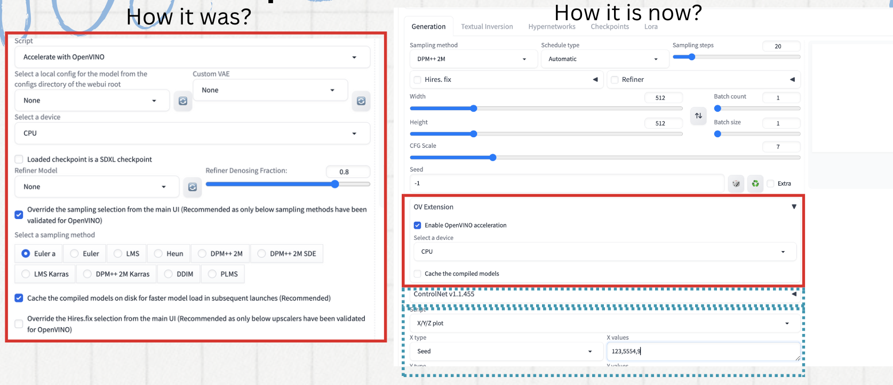
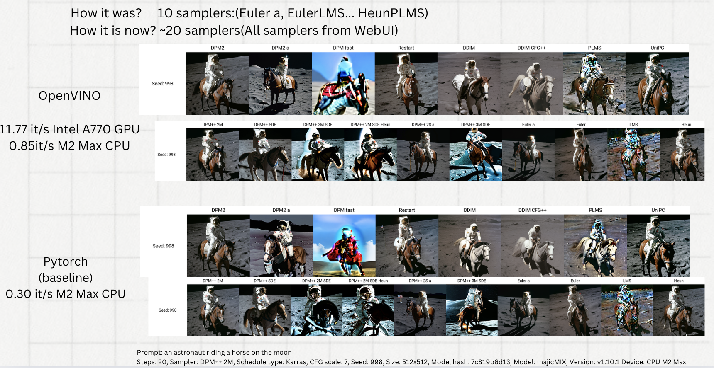
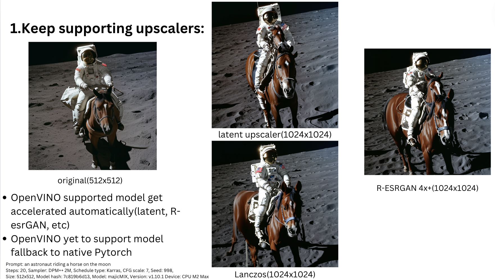
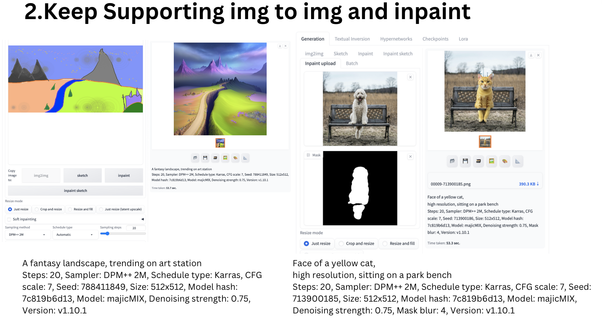
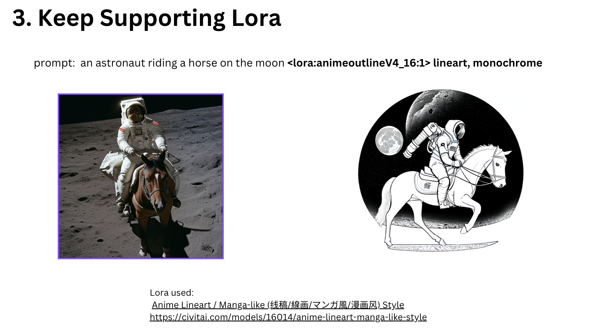
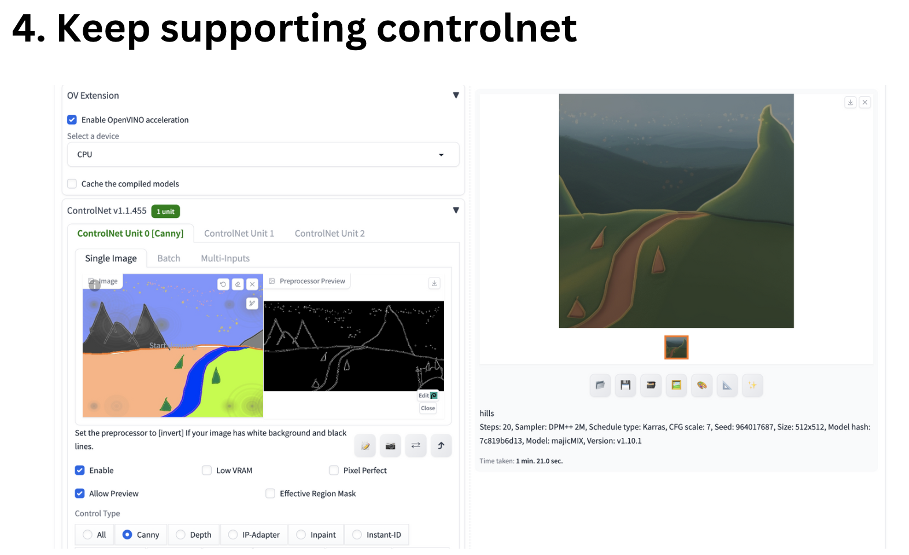

<h1 align = "center">GSoC'24 Report</h1>

<h2>Project : OpenVINO Extension for Automatic1111 Stable Diffusion WebUI </h2>

  

| **Contributer**    | Wang Mengbing                                                                           |
| :------            | :-------------------------------------------------------------------------------------------------------------|
| **Mentor**         |  Anna Likholat, Mustafa Cavus                                             |
| **Organization**   | [OpenVINO Toolkit](https://summerofcode.withgoogle.com/programs/2024/organizations/openvino-toolkit)                                                              |                                       |

# About Project

   

- ## Primary Goals of the Project 

    Currently OpenVINO is supported in WebUI by a custom script. Implementing OpenVINO through the Automatic1111 extension will provide an easier way to use OpenVINO. 

- ## Benefits After The Project Completion 

    
    - Only 1 script can be selected by WebUI. Converting OpenVINO from Script to Extension provides user with an option to run other scripts.
  
    - Plug and Play mode of extension is easier to install than script.
        
    

# Project Progress

  - **New Installation Method**
   
    

    Step 1: Click Extension Tab

    Step 2: Select Install from URL 

    Step 3: Enter extension repo link address

    Step 4: Install then restart the UI

    
  
  - **New User Experience**
   
  
    Check enable then accelerate background, get the params from webUI

    Work with other script like X/Y/Z plot

    Work with other Extensions like controlnet
  
  - **New Samplers from A11111 WebUI**
     
  
    How it was?     10 samplers:(Euler a, EulerLMS... HeunPLMS)

    How it is now? ~20 samplers(All samplers from WebUI) 

  - **Keep supporting upscalers**
     
    - OpenVINO supported model get accelerated automatically(latent, R-esrGAN, etc)
    - OpenVINO yet to support model fallback to native Pytorch
  - 
  - **Keep Supporting img to img and inpaint**
     
  - **Keep Supporting Lora**
   
  - **Keep supporting controlnet**
     

## Future Work
- Public of the extension as a new openvinotoolkit Github repo
- Integrate the extension to A1111 extensions list repo
Verify and support latest controlnet type like IP-adaptor, InstantID, etc

